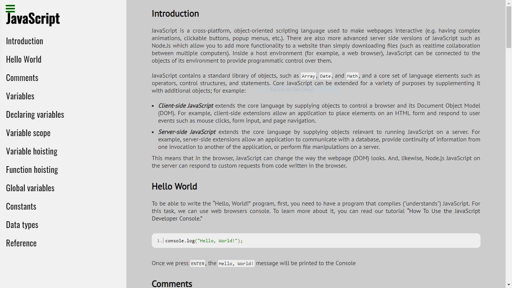
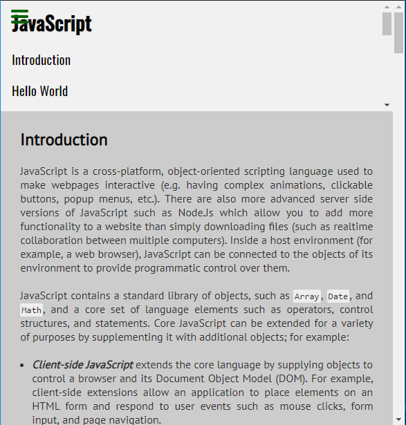

# FCC-Documentation
**Build a Technical Documentation Page** - It is a project made to [FreeCodeCamp](https://learn.freecodecamp.org/) to the Responsive Web Design Course.

### Built With
- HTML5 
- CSS3
- JavaScript

**What I learn with this project:** in this project I change the 

## Images

- Documentation (FullScreen)

- Documentation (600px)

